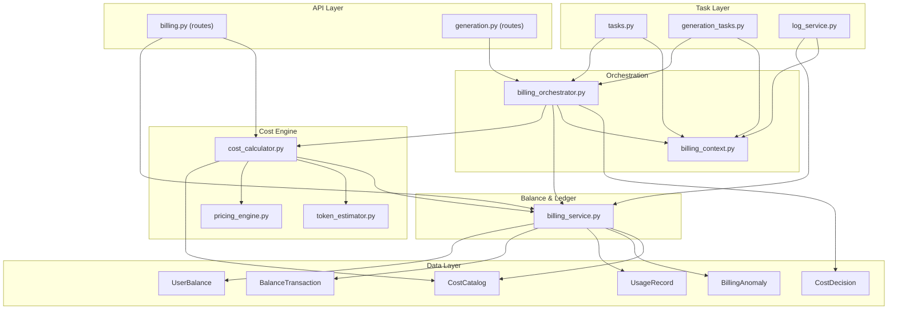
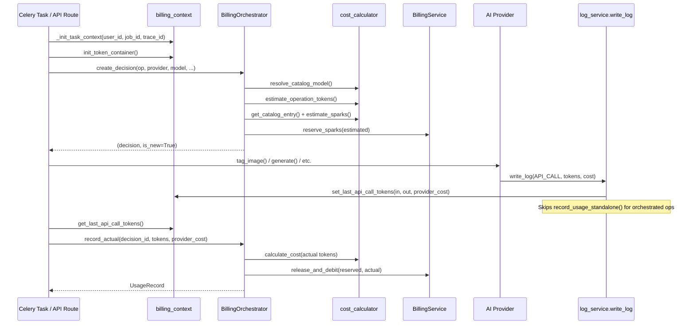
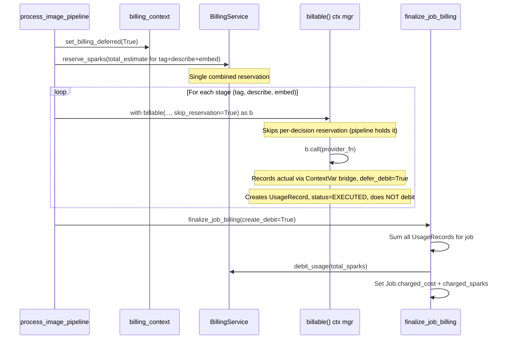
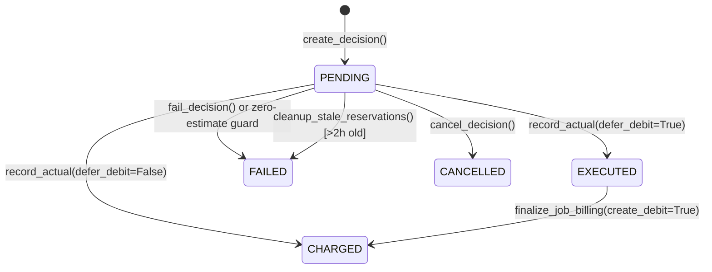
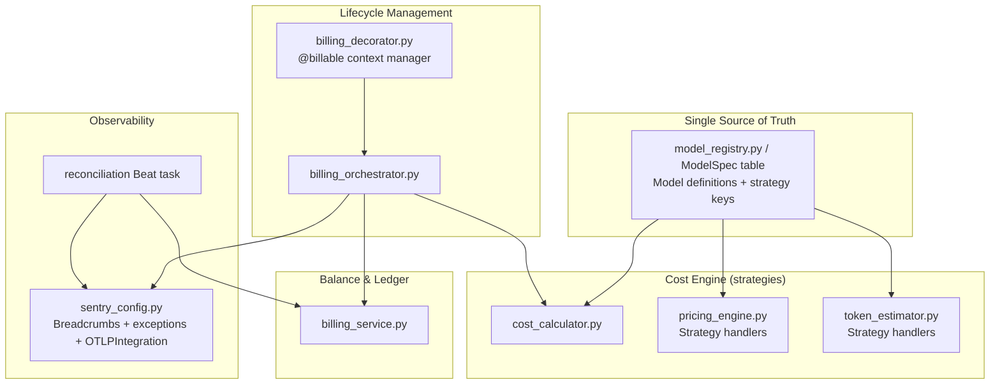

# Billing & Costing Architecture Review

> **Status:** Living document — updated as the billing system evolves.
> **Last reviewed:** 2026-03-03
> **Companion doc:** [Observability Architecture Review](./observability-architecture-review.md)

---

## Glossary

| Term | Definition |
|------|-----------|
| **Spark** | Internal currency unit. 1 spark = $0.001 USD. All user-facing balances, estimates, and charges are denominated in sparks. Defined as `USD_TO_SPARKS = Decimal("1000")` in `cost_calculator.py:16`. |
| **Raw cost** | The USD cost computed from catalog rates (per-token × tokens, or per-call) or reported directly by the provider (e.g., fal.ai returns `provider_cost` in its response). No markup applied. |
| **Charged cost** | `raw_cost × platform_markup`. This is what the user actually pays. Converted to sparks for balance operations. |
| **Provider cost** | The USD amount the upstream provider (fal.ai, OpenAI, etc.) reports for a single API call. Available in fal.ai responses; not available from OpenAI/Anthropic (must be computed from token counts × catalog rates). |
| **Actual usage** | The real token counts and/or provider cost returned by a completed provider call. Contrasted with "estimated usage" which is computed before the call. Currently transported via ContextVars (`_last_api_tokens_var`), which is fragile — see B.4. |
| **Estimated usage** | Token counts predicted by `token_estimator.py` before a provider call. Used for reservation sizing. May differ significantly from actual — see B.4. |
| **Reservation** | Sparks locked on `UserBalance.reserved_sparks` before a provider call. Prevents overspend from concurrent operations. Released on success (and actual is debited) or failure (released with no debit). |
| **CostDecision** | A DB record (`cost_decisions` table) created before every billable provider call. Captures the full billing context: estimated tokens, catalog snapshot, request/response data, final status. The audit backbone. |
| **Catalog entry** | A row in `CostCatalog` defining the price for a specific `(provider, model, operation)` triple. Includes per-token rates, per-call rate, and platform markup. |
| **Catalog match tier** | How a catalog entry was found: `exact` (provider+model+operation), `wildcard` (model=`"*"`), `prefix` (model=`"fal-ai/*"`), or `none` (triggers anomaly). |
| **Platform markup** | Multiplier applied to raw cost. Stored per `CostCatalog` entry (default 2.0x). Configurable via admin API. |
| **Deferred billing** | Pipeline jobs (tag+describe+embed) create `UsageRecord`s but defer the balance debit. A single debit is created at job completion via `finalize_job_billing(create_debit=True)`. |
| **Quote** | A cost estimate produced by `quote_operation()` for a specific `(operation, provider, model, params)` tuple. Contains: estimated sparks, assumptions array, canonical params, and a `quote_hash` (SHA256 of canonical inputs) for deduplication and traceability. Today, the UI and orchestrator may pass different parameters, producing different numbers. The target architecture persists quote data on `CostDecision` (`quote_hash`, `quote_inputs`, `quote_outputs` columns) so the delta is explainable. See B.4, C.2 #7. |

---

## Part A — Current State

### A.1 — Billing Module Map

Key modules that collaborate to price, authorize, execute, and record every billable operation:



**Key files:**

| Module | Path | Lines | Purpose |
|--------|------|-------|---------|
| Billing Orchestrator | `backend/app/services/billing_orchestrator.py` | ~230 | CostDecision lifecycle (create → record → fail/cancel) |
| Billing Service | `backend/app/services/billing_service.py` | ~1230 | Balance management, MODEL_MAPs, usage recording, finalization |
| Cost Calculator | `backend/app/services/cost_calculator.py` | ~320 | Pure cost math, catalog lookup, model name resolution |
| Pricing Engine | `backend/app/services/pricing_engine.py` | ~130 | Variable pricing functions (megapixel, resolution multipliers) |
| Billing Context | `backend/app/services/billing_context.py` | ~185 | ContextVars for user_id, trace_id, token pass-back, idempotency keys |
| Token Estimator | `backend/app/services/token_estimator.py` | ~275 | Vision/embedding token estimation formulas per provider/model |
| Billing Routes | `backend/app/api/billing.py` | ~1370 | REST endpoints for balance, costs, estimates, admin, reconciliation |

**DB models** (`backend/app/models/billing.py`, `backend/app/models/cost_decision.py`):

| Model | Table | Purpose |
|-------|-------|---------|
| `CostCatalog` | `cost_catalog` | Provider/model/operation pricing rates + markup |
| `CostDecision` | `cost_decisions` | Pre-persisted billing decision per provider call |
| `UsageRecord` | `usage_records` | Actual token counts and costs after execution |
| `UserBalance` | `user_balance` | Cached spark balance + reserved sparks |
| `BalanceTransaction` | `balance_transactions` | Append-only ledger (credit/debit/adjustment) |
| `BillingAnomaly` | `billing_anomalies` | Catalog misses, zero-cost actuals, unexpected states |

---

### A.2 — The Money Path

#### Sequence 1: Orchestrator Path (tag, describe, embed, generate, edit, train, evaluate, summarize, expand_prompt)

All operations in `ORCHESTRATOR_ENABLED_OPS` follow this lifecycle:



**Entry points using orchestrator:**
- `tasks.py`: `tag_image()`, `describe_image()`, `embed_image()`, `tag_and_describe_image()`, `summarize_cluster()`
- `generation_tasks.py`: `generate_image()`, `edit_image()`, `train_lora()`, `evaluate_lora()`
- `api/generation.py`: `expand_prompt()`

#### Actual Usage Contract — Updated March 2026

Every provider call must ultimately produce actual usage data so billing can compute the real charge. The data flows through two paths:

**Path 1 (preferred): `billable.call()` wrapper**
All task functions now use the `billable()` context manager:
```python
with billable(db, user_id, operation="tag", provider="openai", model="gpt-4o", ...) as b:
    result = b.call(tagger.tag_image, image_data, prompt)
```
`b.call()` internally: (1) invokes the provider function, (2) reads `get_last_api_call_tokens()` from the ContextVar bridge, (3) calls `_record_from_context()` to persist actual usage on the CostDecision. On exception: automatically calls `fail_decision()`.

**Path 2 (escape hatch): `b.set_actual()` explicit**
For cases where ContextVars are unavailable or the provider returns data in a non-standard way:
```python
with billable(...) as b:
    result = provider.some_call(...)
    b.set_actual(input_tokens=100, output_tokens=50, provider_cost=0.02)
```

**Path 3 (deprecated fallback): ContextVar-only**
If neither `b.call()` nor `b.set_actual()` is used, `_on_exit()` attempts to read tokens from the ContextVar bridge and logs a deprecation warning. This path exists for backward compatibility during migration.

**What must come back from each provider call:**

| Field | Type | Required | Source |
|-------|------|----------|--------|
| `input_tokens` | int | Required for per-token ops, None for per-call | Provider API response (`usage.prompt_tokens`) |
| `output_tokens` | int | Required for per-token ops, None for per-call | Provider API response (`usage.completion_tokens`) |
| `provider_cost_usd` | Decimal | Required for fal.ai (per-call), None for OpenAI/Anthropic | fal.ai response payload |
| `unit_metrics` | dict | Not captured today | e.g., `{"megapixels": 1.2, "resolution": "1024x1024", "steps": 30}` |
| `raw_response` | dict | Partial (request/response snapshots on CostDecision) | Provider API response blob |

**Remaining concern:** The underlying ContextVar transport (`_last_api_tokens_var`) is still the mechanism by which `write_log()` passes tokens to `b.call()`. The target (explicit return values from provider functions) is not yet implemented. However, the `billable()` wrapper significantly reduces the risk window — the extract-and-record flow is now atomic within `b.call()` rather than being a multi-step manual process.

#### Sequence 2: Deferred Billing Path (pipeline: tag + describe + embed in one job) — Updated March 2026

**Pipeline-level reservation:** Instead of reserving per-operation, the pipeline now estimates total cost (tag + describe + embed) upfront and reserves once. Each sub-operation uses `skip_reservation=True` to avoid redundant per-decision reservations.



The deferred path exists because pipeline jobs (tag+describe+embed) should appear as a single debit on the user's transaction ledger rather than three separate charges. Each sub-operation still gets its own `CostDecision` and `UsageRecord` for auditability, but balance deduction is aggregated.

#### Sequence 3: CostDecision State Machine



**State definitions** (`backend/app/models/cost_decision.py:21-26`):

| Status | Meaning | Reservation |
|--------|---------|-------------|
| `PENDING` | Decision created, provider call not yet complete | Held |
| `EXECUTED` | Provider succeeded, cost recorded, debit deferred | Released |
| `CHARGED` | Provider succeeded, balance debited | Released + debited |
| `FAILED` | Error (provider, billing, or zero-estimate guard) | Released |
| `CANCELLED` | User-initiated or system cancellation | Released |

> **Proposed status (Phase 2+):** `EXECUTED_UNBILLED` — provider succeeded but actual usage was not captured. Reservation released, no debit. Treated as an incident state requiring manual resolution. See [C.1b — Missing Actual Policy](#c1b--missing-actual-policy).

---

### A.3 — Operations Catalog

Complete matrix of billable operations.

> **Note:** "Model (catalog key)" is the string stored in `CostCatalog.model` — this may differ from the provider's API model ID. For example, fal.ai endpoints are identified by their fal endpoint path (`fal-ai/flux/dev`), not a model version string.

| Operation | Provider | Model (catalog key) | Billing Model | Cost Driver | Entry Point |
|-----------|----------|-------------------|---------------|-------------|-------------|
| `tag` | openai | gpt-4o / gpt-4o-mini / gpt-5-mini / gpt-5.2 | per_token | Image tokens + prompt | `tasks.py:tag_image()` |
| `tag` | anthropic | claude-sonnet-4-20250514 | per_token | Image tokens + prompt | `tasks.py:tag_image()` |
| `tag` | fal (openrouter) | xai/grok-4-fast | per_token | Image tokens + prompt | `tasks.py:tag_image()` |
| `describe` | openai | gpt-4o / gpt-5-mini / gpt-5.2 | per_token | Image tokens + prompt | `tasks.py:describe_image()` |
| `describe` | anthropic | claude-sonnet-4-20250514 | per_token | Image tokens + prompt | `tasks.py:describe_image()` |
| `describe` | fal (openrouter) | xai/grok-4-fast | per_token | Image tokens + prompt | `tasks.py:describe_image()` |
| `embed` | openai | text-embedding-3-small | per_token | Tags + description text | `tasks.py:embed_image()` |
| `summarize` | openai | gpt-4o-mini | per_token | Cluster member text | `tasks.py:summarize_cluster()` |
| `summarize` | anthropic | claude-sonnet-4-20250514 | per_token | Cluster member text | `tasks.py:summarize_cluster()` |
| `expand_prompt` | openai | gpt-4o-mini (configurable) | per_token | Prompt text | `api/generation.py:expand_prompt()` |
| `generate` | fal | fal-ai/flux/dev | per_call | Flat rate | `generation_tasks.py:generate_image()` |
| `generate` | fal | fal-ai/flux-lora | per_call | Flat rate (with LoRA) | `generation_tasks.py:generate_image()` |
| `generate` | fal | fal-ai/qwen-image-2512 | per_call | Flat rate | `generation_tasks.py:generate_image()` |
| `generate` | fal | fal-ai/qwen-image-2512/lora | per_call | Flat rate (with LoRA) | `generation_tasks.py:generate_image()` |
| `generate` | fal | fal-ai/nano-banana-pro | variable | Resolution × base rate | `generation_tasks.py:generate_image()` |
| `generate` | fal | fal-ai/nano-banana-2 | variable | Resolution × base rate | `generation_tasks.py:generate_image()` |
| `generate` | fal | fal-ai/flux-2-pro | variable | Megapixels ($0.03 + $0.015/extra MP) | `generation_tasks.py:generate_image()` |
| `edit` | fal | fal-ai/qwen-image-max/edit | per_call | Flat rate | `generation_tasks.py:edit_image()` |
| `edit` | fal | fal-ai/kling-image/o3/image-to-image | per_call | Flat rate | `generation_tasks.py:edit_image()` |
| `edit` | fal | fal-ai/wan-25-preview/image-to-image | per_call | Flat rate | `generation_tasks.py:edit_image()` |
| `edit` | fal | xai/grok-imagine-image/edit | per_call | Flat rate | `generation_tasks.py:edit_image()` |
| `edit` | fal | half-moon-ai/ai-face-swap/faceswapimage | per_call | Flat rate | `generation_tasks.py:edit_image()` |
| `edit` | fal | fal-ai/nano-banana-pro/edit | variable | Resolution × base rate | `generation_tasks.py:edit_image()` |
| `train` | fal | fal-ai/flux-lora-fast-training | per_call | Flat rate | `generation_tasks.py:train_lora()` |
| `train` | fal | fal-ai/qwen-image-2512-trainer-v2 | per_call | Flat rate | `generation_tasks.py:train_lora()` |
| `evaluate` | openai/anthropic/fal | (per provider config) | per_token | Vision + embedding | `generation_tasks.py:evaluate_lora()` |

---

### A.4 — Model Name Resolution

Short frontend model keys (e.g., `"flux-dev"`) must be resolved to full catalog identifiers (e.g., `"fal-ai/flux/dev"`) before pricing. This happens through **three MODEL_MAP dicts** in `BillingService` and a resolver function.

**Three MODEL_MAP dictionaries** (`billing_service.py:427-486`):

```
GENERATION_MODEL_MAP  (5 base models × 1-2 variants = 7 entries)
├── flux-dev      → with_lora: (fal, fal-ai/flux-lora, generate)
│                 → without_lora: (fal, fal-ai/flux/dev, generate)
├── qwen-2.5     → with_lora: (fal, fal-ai/qwen-image-2512/lora, generate)
│                 → without_lora: (fal, fal-ai/qwen-image-2512, generate)
├── nano-banana-pro → without_lora: (fal, fal-ai/nano-banana-pro, generate)
├── nano-banana-2   → without_lora: (fal, fal-ai/nano-banana-2, generate)
└── flux-2-pro      → without_lora: (fal, fal-ai/flux-2-pro, generate)

EDIT_MODEL_MAP  (6 entries)
├── qwen-image-max-edit    → (fal, fal-ai/qwen-image-max/edit, edit)
├── kling-image            → (fal, fal-ai/kling-image/o3/image-to-image, edit)
├── wan-25                 → (fal, fal-ai/wan-25-preview/image-to-image, edit)
├── grok-imagine           → (fal, xai/grok-imagine-image/edit, edit)
├── face-swap              → (fal, half-moon-ai/ai-face-swap/faceswapimage, edit)
└── nano-banana-pro-edit   → (fal, fal-ai/nano-banana-pro/edit, edit)

TRAINING_MODEL_MAP  (2 entries)
├── flux-dev  → (fal, fal-ai/flux-lora-fast-training, train)
└── qwen-2.5  → (fal, fal-ai/qwen-image-2512-trainer-v2, train)
```

**Resolution function** (`cost_calculator.py:226-263`):

`resolve_catalog_model(provider, model, operation, with_lora)` checks if the model already contains "/" (full name passthrough). Otherwise it looks up the appropriate MODEL_MAP based on operation type, returning `(provider, catalog_model, operation)`.

**Catalog lookup hierarchy** (`cost_calculator.py:21-82`):

`get_catalog_entry(db, provider, model, operation)` tries:
1. **Exact match** — provider + model + operation
2. **Wildcard model** — provider + `"*"` + operation
3. **Prefix match** — provider + `"prefix*"` + operation (longest prefix wins)
4. **None** — returns `(None, "none")`, triggers `BillingAnomaly`

---

### A.5 — Settings Audit

Where billing-related parameters live:

| Parameter | Storage | Authority | Read By | Written By |
|-----------|---------|-----------|---------|------------|
| Cost rates (per-token, per-call) | `CostCatalog` table | **Source of truth** | `cost_calculator.py` | Admin API (`billing.py` CRUD) |
| Platform markup | `CostCatalog.platform_markup` (per entry) | **Source of truth** | `cost_calculator.py` | Admin API |
| Variable pricing formulas | `pricing_engine.py` `_PRICING_REGISTRY` dict | Code (hardcoded) | `cost_calculator.estimate_sparks()` | Deploy only |
| Token estimation formulas | `token_estimator.py` constants | Code (hardcoded) | `cost_calculator.estimate_operation_tokens()` | Deploy only |
| MODEL_MAP (gen/edit/train) | `billing_service.py` class-level dicts | Code (hardcoded) | `cost_calculator.resolve_catalog_model()` | Deploy only |
| Sparks exchange rate | `cost_calculator.py` `USD_TO_SPARKS = 1000` | Code (constant) | All billing modules | Deploy only |
| User balance | `UserBalance` table | **Source of truth** (cached) | `BillingService.get_balance()` | `add_credits()`, `debit_usage()`, `reserve/release` |
| Provider config (which model to use) | `AppSetting` table | **Source of truth** | `settings_service.py` | Settings UI |
| Generation config (per base model) | `AppSetting` table | **Source of truth** | `settings_service.py` | Settings UI |
| Provider API keys | `APIKey` table (encrypted) | **Source of truth** | Provider factories | Settings UI |
| Stale reservation cutoff | `tasks.py` hardcoded `timedelta(hours=2)` | Code (hardcoded) | `cleanup_stale_reservations()` | Deploy only |
| Billing deferred flag | `billing_context.py` ContextVar | Runtime state | `is_billing_deferred()` | `set_billing_deferred()` per task |

**Key problem:** Items marked "Code (hardcoded)" can only change via code deploy, and there is no validation that they stay consistent with DB-stored sources of truth (`CostCatalog`, `AppSetting`). This is the root of the many-registries problem (B.2).

---

### A.6 — Observability Baseline

**What exists today:**

| Layer | Status | Detail |
|-------|--------|--------|
| Sentry error tracking | Active | 100% sample rate, DSN from DB. Initialized in `main.py` and Celery `worker_ready`. Tags: `app.trace_id`, `app.job_id`, `app.user_id` |
| Structured logging | Active | `logger.info("ORCH decision \| ...")` and `logger.info("BILLING \| ...")` with structured fields. `TraceIdFilter` injects trace_id into all log records |
| OTel tracing | Configured but **spans silently dropped** | `otel.py` initializes TracerProvider and instruments SQLAlchemy/Redis/HTTPX/FastAPI. However, with Sentry's default `instrumenter="sentry"`, OTel spans are ignored. `provider_span()` creates spans in 4 provider files but they go nowhere |
| Billing context | Active | 8 ContextVars (`user_id`, `job_id`, `image_id`, `trace_id`, `session_id`, `billing_deferred`, `last_api_tokens`, `last_usage_record_id`) |
| CostDecision audit trail | Active | Every orchestrated op creates a `CostDecision` with `trace_id`, request/response snapshots, estimated vs actual tokens, catalog match tier |
| BillingAnomaly | Active | Catalog misses recorded automatically. Admin API for listing/resolving/creating catalog entries from anomalies |
| Health metrics | Active | `BillingService.get_metrics()` computes failure rate, cancel rate, stale decisions, avg estimate-vs-actual delta, catalog misses over configurable window |
| Reconciliation | **Automated** | Hourly `reconcile_billing()` Celery Beat task detects: stale decisions (>30min PENDING), missing actuals, estimate drift (>50%), reservation leaks. Admin endpoint `GET /billing/admin/reconciliation` for manual review. `GET /admin/anomalies/trend` for hourly anomaly counts |
| OTel billing metrics | Active | 9 instruments in `_BillingMeters` class: counters for decisions/failures/cancellations/anomalies/catalog_misses; histograms for estimate_delta_pct, charge_sparks, debit_latency_ms, reservation_sparks |
| Request context | Active | `RequestContextMiddleware` generates `trace_id` + `request_id` per HTTP request. Frontend sends `X-Trace-Id` + `X-Session-Id`. Both echoed in response headers |
| Frontend Sentry | Active | `@sentry/react` with error boundaries (`error.tsx`, `global-error.tsx`). Observability helpers in `lib/observability.ts` |
| Trace reconstruction | Active | Admin endpoint `GET /billing/admin/trace/{trace_id}` reconstructs full billing trace: decisions + usage records + pipeline logs + transactions |

**Cross-reference:** See [Observability Architecture Review](./observability-architecture-review.md) sections D.1 (golden metrics), F (tooling decision — Sentry + OTel + PostHog), and K (Sentry Logs integration).

---

## Part B — Failure Analysis

### B.0 — Executive Root Causes

The billing system has sophisticated infrastructure (orchestrator pattern, idempotency, reservations, deferred billing, anomaly tracking). Three structural problems were identified; all three have been addressed as of March 2026:

**1. ~~Mismatch between decision lifecycle and task lifecycle.~~** **RESOLVED** via the `billable()` context manager (`billing_decorator.py`). All provider calls now use `with billable(...) as b: result = b.call(provider_fn)`. The context manager's `_on_exit()` handler ensures decisions are finalized (via ContextVar fallback in migration mode) even on exceptions or early returns. All ~10 call sites migrated.

**2. ~~Model/catalog resolution depends on scattered code dictionaries.~~** **RESOLVED** via `model_registry.py`. A unified `ModelRegistry` consolidates the 3 `MODEL_MAP` dicts. Startup validation (`validate_against_catalog(db)`) checks every registered model against `CostCatalog` and logs errors for mismatches. Adding a model is now a single `register()` call + catalog entry.

**3. ~~Actual usage transport is implicit and fragile.~~** **MITIGATED** via `billable.call()`. The preferred path (`b.call(fn)`) automatically extracts tokens from the ContextVar bridge and records actual usage in one step. The ContextVar remains as transport but is no longer the "only mechanism" — `b.call()` wraps the entire extract-and-record flow with error handling. `b.set_actual()` provides an explicit escape hatch when ContextVars are unavailable.

**Remaining concern:** The ContextVar bridge still exists as the underlying transport for token data from `write_log()` to `b.call()`. The target (explicit return values from provider calls) is not yet implemented. However, the `billable()` context manager significantly reduces the window for silent failures — decisions left in PENDING trigger the `_on_exit()` fallback + reconciliation task detection.

**Additional fix (March 2026): Tenacity @retry decorators removed from all providers.**
All 23 `@retry` decorators were removed from the 4 provider files (`openai_provider.py`, `anthropic_provider.py`, `fal_provider.py`, `fal_vision_provider.py`). The retry lambda had a bug where it returned `True` on success, causing every successful API call to be retried up to 3 times — tripling API costs. Provider failures are now surfaced immediately to the user. A regression test (`tests/test_no_retry_decorators.py`) prevents future retry decorator usage.

---

### B.1 — Failure Taxonomy

| # | Failure Mode | Severity | Likelihood | Detection | Recovery | Status (Mar 2026) |
|---|-------------|----------|------------|-----------|----------|---|
| 1 | **Catalog miss → charges $0** | HIGH | HIGH (on new model) | `BillingAnomaly` record + `BILLING MISS` log warning | Admin creates catalog entry; past operations unchargeable | **Mitigated** — `ModelRegistry.validate_against_catalog()` runs at startup, catching mismatches before production traffic |
| 2 | **MODEL_MAP not updated → wrong catalog lookup** | HIGH | HIGH (on new model) | Silent — resolves to wrong model or falls through to raw name | Manual fix in code + re-deploy | **Resolved** — `model_registry.py` consolidates all MODEL_MAPs. Single `register()` call per model |
| 3 | **Pricing engine not updated → flat rate instead of variable** | MEDIUM | MEDIUM | Overcharges or undercharges; no alert | Add function to `_PRICING_REGISTRY` | Open |
| 4 | **Provider succeeds but `record_actual()` crashes** | HIGH | LOW | Reservation leak (sparks locked but never debited/released) | `cleanup_stale_reservations()` runs periodically, marks as FAILED after 2h | **Mitigated** — `billable()` context manager's `_on_exit()` provides fallback recording. Hourly `reconcile_billing()` task detects stale PENDING decisions (>30min) |
| 5 | **Zero-cost estimate (guard triggers)** | MEDIUM | HIGH (on misconfiguration) | `ZeroCostEstimateError` raised, decision marked FAILED, operation blocked | Fix catalog entry or MODEL_MAP | Open (expected behavior) |
| 6 | **OTel provider spans silently dropped** | MEDIUM | CERTAIN | None — no spans visible in any backend | Enable `OTLPIntegration` in sentry_config.py | Open — OTel installed but Sentry `instrumenter="sentry"` drops OTel spans |
| 7 | **No `sentry_sdk.capture_exception()` in billing code** | MEDIUM | CERTAIN | Billing errors logged but not in Sentry Issues | Add capture calls in orchestrator error paths | **Partially addressed** — Sentry SDK installed, billing errors surface via Sentry's logging integration. Explicit `capture_exception()` calls not yet added |
| 8 | **Token estimation inaccuracy** | LOW | MEDIUM | `get_metrics()` shows avg delta % between estimated and actual | Tune `token_estimator.py` constants | Open |
| 9 | **Concurrent reservation overspend** | LOW | LOW | `UserBalance.reserved_sparks` goes negative | `reserve_sparks()` uses atomic `UPDATE ... SET reserved_sparks = reserved_sparks + ?` | Open (existing safeguard) |
| 10 | **`finalize_job_billing()` double-debit** | LOW | LOW | Unique partial index on `balance_transactions(user_id, reference_id)` for debits prevents duplicates | `IntegrityError` caught silently | Open (existing safeguard) |
| 11 | **Provider cost mismatch (fal.ai actual vs catalog)** | LOW | MEDIUM | Reconciliation endpoint shows delta; no automated alert | Admin reviews reconciliation dashboard |
| 12 | **Actual usage missing (ContextVar lost) → cost computed as 0** | HIGH | MEDIUM | Reconciliation shows zero-actual anomaly; no runtime alert | Pass explicit usage from provider boundary; see C.2 #2 |
| 13 | **Decision remains PENDING due to early return/cancel → funds reserved, never debited** | HIGH | MEDIUM | Stale cleanup metrics (2h lag); user sees "stuck" balance | Ensure `finally:` paths in all task code; decorator auto-finalizes; see C.2 #2 |

---

### B.2 — The Many Registries Problem — ~~RESOLVED~~ (March 2026)

> ~~A "model" is currently defined in multiple places with no single authoritative schema, making correctness non-verifiable at startup.~~

**Resolution:** `model_registry.py` implements the `ModelRegistry` proposed in C.2 #1. Adding a model now requires:

```
1. ModelRegistry.register() in model_registry.py  ← Single source of truth for short name → catalog key
2. CostCatalog DB rows                            ← Pricing rates (via admin API or migration)
3. _PRICING_REGISTRY in pricing_engine.py          ← Variable pricing function (if applicable)
4. Frontend model selectors                        ← UI dropdowns
```

**What changed:**
- Steps 1+5 (MODEL_MAP + provider routing) collapsed into `model_registry.py` with `register()` calls
- **Startup validation:** `validate_against_catalog(db)` runs on app boot and Celery `worker_ready`. Compares every registered model against `CostCatalog` and logs mismatches
- **Resolution function:** `ModelRegistry.resolve(short_name, operation, with_lora)` replaces the 3 `resolve_catalog_model()` lookups in `billing_service.py`
- `get_pricing_strategy_key()` links models to their pricing function

**Remaining gaps:**
- Steps 3-4 (pricing_engine, token_estimator) are still separate code registries — not yet consolidated into the ModelRegistry
- Frontend model selectors are still hardcoded (not served from ModelRegistry via API)
- Target state (DB-backed `ModelSpec` table) not yet implemented

---

### B.3 — Observability Gaps in Billing — Status Update (March 2026)

**Sentry for billing failures — PARTIALLY ADDRESSED:**
Sentry SDK is now installed and initialized (`sentry_config.py`). The `LoggingIntegration` captures `logger.error()` calls in Sentry at the ERROR level. However:
- ~~No explicit `sentry_sdk.capture_exception()` calls~~ — billing errors now surface in Sentry via the logging integration, but dedicated `capture_exception()` calls with billing-specific context (decision_id, estimated/actual sparks) are not yet added
- `record_usage_standalone()` still swallows exceptions in a bare `except` block (`billing_service.py`)

**Sentry breadcrumbs for billing lifecycle — NOT YET IMPLEMENTED:**
The reserve → execute → debit lifecycle produces structured logs but no Sentry breadcrumbs. This gap remains.

**Provider spans created but dropped — UNCHANGED:**
All 4 provider files wrap calls in `provider_span()` (OTel spans with `ai.provider`, `ai.operation`, `ai.model` attributes). These are still silently dropped because Sentry's `instrumenter="sentry"` ignores OTel spans. Fix: enable `OTLPIntegration` in `sentry_config.py`.

**Automated reconciliation — IMPLEMENTED:**
- ~~No Celery Beat schedule~~ → `reconcile_billing()` runs hourly via Celery Beat (3600s interval)
- Detects 4 anomaly types: `stale_decision` (>30min PENDING), `missing_actual_reconcile`, `estimate_drift` (>50% delta), `reservation_leak`
- Creates `BillingAnomaly` records with detailed context

**OTel billing metrics — IMPLEMENTED:**
9 OTel instruments in `core/otel.py` (`_BillingMeters` class):
- Counters: `decision_total`, `decision_failed`, `decision_cancelled`, `anomaly_total`, `catalog_miss`
- Histograms: `estimate_delta_pct`, `charge_sparks`, `debit_latency_ms`, `reservation_sparks`

**Remaining gaps:**
- No external alerting (PagerDuty, Slack) on anomalies
- No explicit Sentry breadcrumbs for billing state transitions
- Provider OTel spans still dropped
- `record_usage_standalone()` exception swallowing

---

### B.4 — Estimate vs Actual Coherence Problem

A user sees "~100 sparks" in the UI cost estimate. But the reservation might be 95 sparks (different formula path). And the actual charge might be 140 sparks (provider returned more tokens than estimated). Three different numbers from three different code paths, with no mechanism to explain or reconcile the gap to the user.

**Where the three numbers come from:**

| Number | Code Path | When Computed | What it Uses |
|--------|-----------|---------------|-------------|
| **UI estimate** | `GET /billing/generation-estimate` → `estimate_sparks()` | Before user clicks "Generate" | `token_estimator.py` formulas + `CostCatalog` rates + `pricing_engine.py` (if variable) |
| **Reservation** | `create_decision()` → `estimate_sparks()` | When task starts | Same as UI estimate, but may use different parameters (actual image dimensions vs default 1024x1024) |
| **Actual charge** | `record_actual()` → `calculate_cost()` | After provider returns | Real token counts from API response, or `provider_cost_usd` from fal.ai |

**Root causes of drift:**

1. **Token estimation is inherently imprecise.** Vision token formulas are approximations of undocumented provider algorithms. `token_estimator.py` notes <3% error for large images but ~20% for small images. Reasoning models (gpt-5-mini) add invisible reasoning tokens.
2. **Estimation defaults vs actual parameters.** The UI estimate may use `1024x1024` default dimensions while the actual call processes a `4000x3000` image — completely different token count.
3. **Variable pricing parameters differ.** UI passes `{"resolution": "1K"}` as default; actual call may use `{"resolution": "2K"}` with web search enabled.
4. **No feedback loop.** The delta between estimated and actual is tracked in `get_metrics()` (`avg_delta_pct`), but nothing tunes the estimates or alerts when drift exceeds a threshold.

**Impact:** Users lose trust in the cost estimates. They see "~100 sparks" and get charged 140. Or they see 100 and get charged 60, which sounds good but means the estimate is unreliable in both directions.

**Target: Unified Quoting.** The fix is not to make estimation perfect (it can't be — actual tokens are unknowable until the provider responds). The fix is to make the UI estimate and the reservation use the **same function, same schema, same code path**, and persist the quote so the user can see *why* the charge differs:

```
quote_operation(op, provider, model, params) → Quote {
    estimated_sparks, assumptions, quote_hash, input_params
}
```

- UI calls `quote_operation()` with the user's selected params → shows "~120 sparks for 2K resolution"
- Orchestrator calls `quote_operation()` with the actual runtime params → reserves based on that quote
- `CostDecision` stores `quote_hash` + `quote_inputs` + `quote_outputs` so the estimate is traceable
- After settlement, the user's transaction shows: "Quoted: 120 sparks (2K, 1024x1024). Actual: 135 sparks. Delta driver: provider returned 15% more tokens than estimated."

This collapses the "three sources of truth" into one quoting function with two callers that may pass different params — and the delta becomes explainable, not mysterious. See C.2 #7.

**Hard requirement for UI estimates:** The UI must either:
- **Option A (preferred):** Pass a canonical params object identical to what runtime will use. For operations where params depend on input (e.g., vision tag uses actual image dimensions), the UI must know those dimensions before showing a quote (load image metadata first, then quote).
- **Option B:** Explicitly label the estimate as "default estimate" (`~100 sparks at default 1024x1024`) and show a re-quoted amount once image metadata is known (`~140 sparks at actual 4000x3000`).

Without this, unified quoting is a backend improvement that still produces confusing user-facing numbers.

---

### B.5 — ~~No Easy Way to Add a Model~~ — IMPROVED (March 2026)

Adding a new model now requires:

1. **`ModelRegistry.register()` call** in `model_registry.py` — defines short name, provider, catalog key, operation, LoRA variant, pricing strategy key
2. **Insert `CostCatalog` rows** via admin API or migration — pricing rates
3. Optionally add a **pricing function** to `pricing_engine.py` `_PRICING_REGISTRY`
4. Add the **model to frontend** selectors/config

**What changed:**
- Steps 1+5 from the original list (MODEL_MAP + provider factory wiring) are now a single `register()` call
- **Startup validation** (`validate_against_catalog(db)`) runs on app boot and Celery worker startup — catches missing catalog entries before runtime
- The developer no longer needs to know about 3 separate MODEL_MAP dicts

**What remains:** Steps 3-4 (pricing_engine, frontend selectors) are still separate. Target state: DB-backed `ModelSpec` table with admin UI for model management.

---

## Part C — Target Architecture

### C.1 — Invariants

Rules the billing system must maintain:

| # | Invariant | Status (March 2026) |
|---|-----------|----------------|
| 1 | **No silent free operations** — every billable op must either (a) charge > 0 sparks, or (b) be explicitly flagged as anomaly and quarantined for reconciliation | Pre-execution: enforced by zero-cost estimate guard. Post-execution: **Improved** — hourly `reconcile_billing()` detects `missing_actual_reconcile` and `estimate_drift` anomalies. Zero-cost actuals still not explicitly blocked at the moment of recording |
| 2 | **Pre-authorize before execute** — reserve estimated cost before calling provider | **Enforced.** Pipeline jobs use combined reservation (`skip_reservation=True` on sub-ops). Individual ops reserve per-decision |
| 3 | **Settle after execute** — debit actual cost (or release reservation) after provider returns | **Enforced via `billable()` context manager.** `_on_exit()` handler provides ContextVar fallback in migration mode. `b.call()` wraps provider invocation with automatic recording. `b.fail()` handles exceptions |
| 4 | **Idempotent billing at every boundary** — re-delivery must not double-charge at any level | Partially enforced. Decision creation: `idempotency_key` unique constraint on `CostDecision`. `billable()` returns `b.skipped=True` for duplicate decisions. Debit transaction: unique partial index. **Gap:** `UsageRecord` creation still has no deduplication |
| 5 | **Atomic balance mutations with row-level locking** — reserve/debit/release must be atomic | **Enforced.** Atomic `UPDATE ... SET balance_sparks = balance_sparks - ?` with SQLAlchemy session semantics |
| 6 | **Single source of model truth** — one specification defines a model for all consumers | **Mostly enforced.** `model_registry.py` consolidates MODEL_MAPs with startup validation. Remaining gaps: pricing_engine and token_estimator strategies not yet linked, frontend selectors still hardcoded |
| 7 | **Observable by default** — every billing state transition must be traceable | **Improved.** CostDecision audit trail + Sentry error tracking + OTel billing metrics (9 instruments). Remaining gap: no Sentry breadcrumbs for individual state transitions |
| 8 | **Actual usage must be explicit** — actual usage data must be passed explicitly from the provider boundary to billing | **Improved via `b.call()`.** ContextVars remain as underlying transport, but `b.call()` wraps the extract-and-record flow. `b.set_actual()` provides explicit escape hatch. ContextVar-only path still works as deprecation fallback |
| 9 | **Every state transition emits a durable event** — reserve, execute, record, charge, fail, cancel must each produce both a DB state change and a Sentry breadcrumb | **Partially addressed.** DB state changes exist. OTel counters emitted for decisions/failures/cancellations. Sentry breadcrumbs still not emitted per transition |

---

### C.1b — Missing Actual Policy

When a provider call succeeds but actual usage data is not captured, the system must follow an explicit operational policy rather than silently charging $0. This is the most financially dangerous failure mode (see Failure #12 in B.1).

**Two-phase policy:**

| Phase | Mode | Trigger | Behavior |
|-------|------|---------|----------|
| **Migration** (Phase 0.5 → Phase 2) | `SETTLEMENT_FALLBACK` | `billing.call()` not used, no `set_actual()` called | 1. Check ContextVar for actual data (backward-compat path). 2. If ContextVar has data: use it + log deprecation warning + increment `billing.actual.contextvar_fallback.count`. 3. If ContextVar empty: set `CostDecision.status = FAILED`, error = `"missing_actual_usage"`. Release reservation. Create `BillingAnomaly(type="missing_actual_usage")`. Fire `sentry_sdk.capture_exception(MissingActualError)`. **Return the operation result to the user** (Option A — no disruption). |
| **Enforcement** (Phase 2+ complete) | `SETTLEMENT_REQUIRED` | All tasks use `billing.call()` or explicit `set_actual()` | 1. No ContextVar fallback. 2. If no actual captured: set `CostDecision.status = EXECUTED_UNBILLED` (new status). Release reservation. Create `BillingAnomaly(type="missing_actual_usage", severity="critical")`. Fire `sentry_sdk.capture_exception(MissingActualError)`. **Page via PagerDuty** (this is now a billing incident, not expected). |

**Key decisions:**
- **We never charge $0 silently.** If actual data is missing, the decision is FAILED or EXECUTED_UNBILLED, the reservation is released, and the anomaly is flagged. The user gets their result (the provider already ran), but we track the unbilled operation.
- **EXECUTED_UNBILLED is a new CostDecision status** and an **incident state**, not a normal failure. It means: "provider succeeded, but we couldn't bill. Must be resolved manually." This is distinct from FAILED (provider error) and CANCELLED (user cancelled). Every EXECUTED_UNBILLED decision must:
  - Create a `BillingAnomaly(type="missing_actual_usage", severity="critical")`
  - Fire `sentry_sdk.capture_exception(MissingActualError)` immediately
  - Appear in a dedicated admin dashboard widget: **"Unbilled Executions (24h)"**
  - Page via PagerDuty (enforcement mode) or high-severity Slack alert (migration mode)
  - Remain unresolved until an admin manually provides actual usage data or writes off the operation
- **Migration → enforcement flip** is a config toggle (`BILLING_SETTLEMENT_MODE = "fallback" | "required"`). The flip happens when ContextVar fallback count has been 0 for 7 consecutive days.

### C.2 — Proposed Building Blocks

#### 1. Data-Driven Model Specification

The root problem is that "what is a model" is spread across code dictionaries, DB tables, and frontend config. The fix is to make the database the single source of truth for model identity, and have code implement generic strategies that the DB entries select.

**Phase 1 approach (fast):** A `ModelRegistry` in code, validated against `CostCatalog` at startup.

```
ModelRegistry
├── register(short_name, provider, catalog_model, operation, ...)
├── resolve(short_name, operation, with_lora) → (provider, model, operation)
├── get_pricing_fn(provider, model, operation) → Callable | None
├── get_token_estimator(provider, model) → Callable | None
├── validate_against_catalog(db) → list[str]  # startup check
└── all_models() → list[ModelEntry]  # for frontend/admin
```

**Startup validation:** On app boot and Celery worker `worker_ready`, call `validate_against_catalog(db)` to compare every registered model against `CostCatalog`. Log errors and fire Sentry exceptions for any mismatches. The app should refuse to start (or at least degrade loudly) if a registered model has no catalog entry.

**What lives in code vs what lives in DB:**

The key insight: **code should contain strategies (generic, reusable); the DB should contain model definitions that select which strategies apply.** Today it's inverted — code contains model enumerations (specific, fragile) and strategies are implicit.

| Concern | Today (code) | Phase 1 (code registry) | Target (DB-backed) |
|---------|-------------|------------------------|-------------------|
| Model identity (short name → catalog key) | `MODEL_MAP` dicts in `billing_service.py` | `ModelRegistry.register()` calls | `ModelSpec` DB table rows |
| Pricing strategy selection | Implicit in `_PRICING_REGISTRY` dict keys | `ModelRegistry` entries with `pricing_strategy_key` | `ModelSpec.pricing_strategy` column |
| Token estimation strategy | Implicit by provider name in `token_estimator.py` | `ModelRegistry` entries with `token_estimator_key` | `ModelSpec.token_estimator_strategy` column |
| Operation compatibility | Implicit (whatever the provider factory can construct) | `ModelRegistry` entries with `supported_ops` set | `ModelSpec.supported_operations` JSONB |
| UI metadata (display label, defaults) | Frontend hardcoded | `ModelRegistry.all_models()` API | `ModelSpec` columns → served via API |
| Provider routing | `providers/__init__.py` factory functions | Same (code — providers are implementation) | Same (code — providers are implementation) |
| Pricing formulas (e.g., megapixel calc) | `pricing_engine.py` functions | Same (code — strategies are implementation) | Same (code — strategies are implementation) |
| Token estimation formulas | `token_estimator.py` functions | Same (code — strategies are implementation) | Same (code — strategies are implementation) |

**Phase 1 is intermediate.** It consolidates the 3 MODEL_MAP dicts + pricing_engine keys + token_estimator routing into one `ModelRegistry` with startup validation. This alone eliminates the "forgot to update one dict" failure mode.

**Target (Phase 1+):** Replace `ModelRegistry.register()` calls with a `ModelSpec` DB table. Adding a new model that fits existing strategies becomes a single DB insert (via admin API or migration). Adding a model with a genuinely new pricing formula requires one code change (implement the strategy handler) plus one DB insert (define the model, reference the strategy key).

**Provider factories remain in code.** The factory functions in `providers/__init__.py` are implementation details — they construct provider instances from config. These don't need to be data-driven because providers are a bounded set (OpenAI, Anthropic, fal.ai) and each has different SDK setup.

**Files affected:** New `backend/app/services/model_registry.py`. Refactor imports in `billing_service.py`, `cost_calculator.py`, `pricing_engine.py`, `token_estimator.py`.

#### 2. `@billable` Context Manager with Explicit Actual

Eliminate the manual `create_decision()` → provider call → `get_last_api_call_tokens()` → `record_actual()` pattern. This solves both the "missing `record_actual()`" problem (B.0 root cause #1) and the "implicit ContextVar transport" problem (B.0 root cause #3).

```python
# Current pattern (repeated in ~10 places, no finally: guarantee):
decision, is_new = orch.create_decision(op, provider, model, ...)
if is_new:
    result = await provider.tag_image(...)
    in_tok, out_tok, cost = get_last_api_call_tokens()
    orch.record_actual(decision.id, in_tok, out_tok, cost)

# Target pattern:
with billable(orch, op, provider, model, ...) as billing:
    result = await provider.tag_image(...)
    # Explicit actual (preferred — removes ContextVar dependency):
    billing.set_actual(
        input_tokens=result.usage.prompt_tokens,
        output_tokens=result.usage.completion_tokens,
        provider_cost_usd=result.cost,
        unit_metrics={"resolution": "1024x1024"},
    )
    # __exit__ behavior:
    #   1. If set_actual() was called → use explicit values
    #   2. Else fallback to ContextVar (backward compat during migration)
    #   3. If neither → mark decision as ANOMALY, release reservation, flag for review
    #   4. On exception → auto-calls fail_decision(), releases reservation
```

**Even tighter: `billable.call()` wrapping the provider call itself:**

```python
# Tightest pattern — decorator observes the provider response directly:
with billable(orch, op, provider, model, ...) as billing:
    result = await billing.call(provider.tag_image, image_data, prompt=prompt)
    # billing.call() captures the return value, extracts usage from
    # the provider wrapper's return type, and calls set_actual() internally.
    # Caller never touches billing again.
```

This removes "caller forgot to call `set_actual()`" as a failure mode. The decorator knows the provider was called because it invoked it. It can attach request/response snapshots and capture actuals from the provider wrapper's return type.

**Provider boundary contract:** For `billing.call()` to be provider-agnostic, provider wrappers must return a standard response envelope:

```python
@dataclass
class ProviderResponse:
    result: Any                          # The actual result (tags, description, image URL, etc.)
    usage: ProviderUsage | None          # Token counts if available
    provider_cost_usd: Decimal | None    # Provider-reported cost (fal.ai only)
    unit_metrics: dict | None            # Operation-specific metrics (resolution, megapixels, etc.)
    request_id: str | None               # Provider's request ID for tracing

@dataclass
class ProviderUsage:
    input_tokens: int | None
    output_tokens: int | None
```

Today, provider wrappers return heterogeneous types (dicts, custom objects, raw strings) and actual usage is extracted via ContextVar side-channel in `write_log()`. The `ProviderResponse` envelope makes `billing.call()` extraction trivial — it just reads `.usage` and `.provider_cost_usd` from the return value. Providers that can't report usage (some fal.ai endpoints) return `usage=None` and the per-call cost path is used instead.

**Migration path:** Wrap existing provider return values in `ProviderResponse` one provider at a time. The `billing.call()` extractor checks `isinstance(result, ProviderResponse)` — if yes, use structured fields; if no, fall back to ContextVar extraction (migration mode).

**Settlement posture (migration → enforcement):**

| Mode | When | Behavior on missing actual |
|------|------|--------------------------|
| **Migration mode** (Phase 2) | ContextVar fallback still active | Accept ContextVar values, log deprecation warning, emit high-severity breadcrumb + increment `billing.actual.contextvar_fallback.count` counter |
| **Enforcement mode** (Phase 2+) | All tasks migrated to `set_actual()` or `billable.call()` | If provider returned and no actual captured → set `CostDecision.status = EXECUTED_UNBILLED`, release reservation, fire `sentry_sdk.capture_exception(MissingActualError)`, create `BillingAnomaly(type="missing_actual_usage")`. Must appear in admin dashboard + alerts within minutes |

In enforcement mode, "we forgot to pass actual" becomes a **billing incident**, not a silent freebie. See [C.1b — Missing Actual Policy](#c1b--missing-actual-policy) for the full incident handling.

**Key design decisions:**
- `__exit__` always runs (equivalent to `finally:`), guaranteeing settlement
- `billable.call()` is the preferred path — decorator observes provider response directly
- `set_actual()` is the fallback for cases where the provider wrapper can't return usage in a standard shape
- ContextVar fallback exists during migration but logs a deprecation warning and increments a counter
- If neither explicit nor ContextVar actual is available, the decorator flags an anomaly rather than silently recording $0
- Supports `defer_debit=True` for pipeline billing

**Files affected:** New `backend/app/services/billing_decorator.py`. Refactor `tasks.py`, `generation_tasks.py`, `api/generation.py`.

#### 3. Sentry Billing Integration

Add Sentry awareness to every billing state transition:

| Event | Sentry Action |
|-------|--------------|
| `create_decision()` success | `sentry_sdk.add_breadcrumb(category="billing", message="decision_created", data={...})` |
| `reserve_sparks()` success | Breadcrumb: "reserved N sparks" |
| `record_actual()` success | Breadcrumb: "actual cost recorded, N sparks" |
| Zero-cost estimate guard | `sentry_sdk.capture_exception(ZeroCostEstimateError(...))` |
| Zero-cost actual (post-execution) | `sentry_sdk.capture_message("zero-cost actual", level="error")` |
| `fail_decision()` | Breadcrumb + `capture_exception()` if error is unexpected |
| `record_usage_standalone()` failure | `sentry_sdk.capture_exception()` instead of bare `logger.warning` |
| Catalog miss anomaly | `sentry_sdk.capture_message()` with provider/model/operation tags |

**OTel provider spans:** Add `SentrySpanExporter` or `OTLPIntegration` to `sentry_config.py` so that `provider_span()` spans appear in Sentry Performance traces.

**Files affected:** `billing_orchestrator.py`, `billing_service.py`, `sentry_config.py`.

#### 4. Automated Reconciliation

Celery Beat task that runs periodically (e.g., hourly):

1. Query `CostDecision` records from the last window where `status = CHARGED`
2. For each, compare `estimated_sparks` vs linked `UsageRecord.delta_sparks`
3. Flag outliers (> 50% delta) as `BillingAnomaly` records
4. Check for stale `PENDING` decisions (already handled by `cleanup_stale_reservations()` but should be integrated)
5. Fire Sentry alert if anomaly count exceeds threshold

**Files affected:** `tasks.py` (new Beat task), `celery_app.py` (Beat schedule).

#### 5. Unified Billing Observability Plan

We have Sentry and OTel infrastructure. We need to wire billing events into them systematically. This is the "use it" part.

**What we want to see in Sentry:**

| Sentry Surface | What Shows Up | Source |
|----------------|--------------|--------|
| **Issues** | Zero-cost actuals, catalog misses, missing actuals, stale reservations | `capture_exception()` / `capture_message()` from orchestrator |
| **Breadcrumbs** (on any error event) | Full billing lifecycle: decision created → reserved → provider called → actual recorded → charged | `add_breadcrumb()` at each transition |
| **Performance traces** | Provider call spans with `ai.provider`, `ai.operation`, `ai.model`, `ai.tokens.input`, `ai.tokens.output`, `ai.cost` | `provider_span()` via OTLPIntegration |
| **Sentry Logs** | Structured billing log lines (`ORCH decision`, `BILLING`, `BILLING MISS`) searchable by trace_id | `LoggingIntegration` + Sentry Logs (already configured for general logging) |
| **Alerts** | Rules on: anomaly rate > threshold, zero-cost rate > 0, stale PENDING count > 0 | Sentry Alert Rules on issue frequency |

**What we want to see in the admin dashboard:**

| Dashboard Widget | Data Source | Refresh |
|-----------------|------------|---------|
| Estimate vs actual scatter plot | `CostDecision.estimated_sparks` vs `UsageRecord.delta_sparks` | On-demand |
| Anomaly rate trend | `BillingAnomaly` count over time | Hourly |
| Per-operation cost distribution | `UsageRecord` grouped by operation | On-demand |
| Stale reservation count | `CostDecision` where status=PENDING and age > 30min | Real-time |
| Provider latency (p50/p95/p99) | OTel spans via `provider_span()` → Sentry Performance | Real-time |

**OTel metrics (counters/gauges/histograms):**

Breadcrumbs help debug specific incidents. Metrics give "billing health at a glance." Minimum set:

| Metric | Type | Tags | Purpose |
|--------|------|------|---------|
| `billing.decision.created` | Counter | op, provider, model | Volume tracking |
| `billing.decision.pending.count` | Gauge | — | Current unfulfilled decisions |
| `billing.decision.stale.count` | Gauge | — | PENDING decisions older than threshold |
| `billing.actual.missing.count` | Counter | op, provider, model | Provider succeeded but no actual captured |
| `billing.catalog.miss.count` | Counter | provider, model, op | Catalog lookup failures |
| `billing.estimate.delta_pct` | Histogram | op, provider, model | `(actual - estimated) / estimated × 100` — per-operation distribution |
| `billing.debit.latency_ms` | Histogram | op | Time from `decision_created` to `CHARGED` status |
| `billing.reservation.amount_sparks` | Histogram | op | Distribution of reserved amounts |

These can be emitted via OTel `MeterProvider` (same SDK already configured in `otel.py`) or Sentry custom metrics. Without these, we're "finding out from users."

**Implementation order:** Phase 0 (Sentry breadcrumbs + exceptions), Phase 0.5 (zero-cost hard-stop + idempotency fix), Phase 3 (automated reconciliation + Beat schedule + alert rules + metrics).

#### 6. Schema Hardening + Idempotency Fix

The schema gaps aren't "nice to have later" — the 1:1 decision↔usage enforcement and `record_actual()` idempotency are **prerequisites** for reliable billing. These should be part of Phase 0.5, not deferred.

**Critical fix: Make `record_actual()` idempotent and enforce 1:1.**

```python
# In record_actual(), before creating UsageRecord:
existing = db.query(UsageRecord).filter(
    UsageRecord.cost_decision_id == decision_id
).first()
if existing:
    logger.info("ORCH duplicate_actual | decision=%s — returning existing UsageRecord", decision_id)
    return existing  # Don't create another

# Also check decision status:
if decision.status in (DecisionStatus.CHARGED.value, DecisionStatus.EXECUTED.value):
    logger.info("ORCH already_settled | decision=%s status=%s — no-op", decision_id, decision.status)
    # Return the existing record linked to this decision
    ...
```

**DB constraint:** Add `UNIQUE` index on `usage_records.cost_decision_id WHERE cost_decision_id IS NOT NULL`. This makes the 1:1 guarantee enforceable at the DB level even if application logic has bugs.

**Schema gaps to address:**

| Gap | Why it Matters | Proposed Fix | When |
|-----|---------------|-------------|------|
| `UsageRecord.cost_decision_id` is nullable and not unique | Can't guarantee 1:1; retried `record_actual()` creates duplicates, causing mismatched debit vs usage | Add UNIQUE index (partial, WHERE NOT NULL). Make `record_actual()` check-before-insert. Backfill + NOT NULL constraint after migration stabilizes | **Phase 0.5** |
| No `pricing_strategy_key` on CostDecision | When pricing strategy changes, historical decisions can't explain why they charged what they charged | Add `pricing_strategy` column (e.g., `"flat"`, `"per_token"`, `"variable:flux_2_pro_mp"`) | Phase 1 |
| No `quote_hash` / `quote_inputs` on CostDecision | Can't trace whether UI estimate and reservation used the same parameters | Add `quote_hash` (SHA256 of canonical params) + `quote_inputs` (JSONB of params used for estimation) | Phase 1 |
| No catalog version / snapshot version | Catalog rate changes rewrite history — old decisions reference current catalog entry but were charged at old rates | `CostDecision` already snapshots `cost_per_input_token`, `cost_per_output_token`, `cost_per_call`, `platform_markup` at decision time — this is adequate. Document that these are the authoritative rates for that decision | N/A (already done) |
| `BalanceTransaction.reference_type` is implicit | `reference_id` is an int that could point to a UsageRecord, but there's no type discriminator | Add `reference_type` enum column (`usage_record`, `admin_adjustment`, etc.) for clarity | Phase 1 |

#### 7. Canonical Quote Pipeline: Quote → Decide → Execute → Settle → Reconcile

Today, `CostDecision` does triple duty: it's the quote, the reservation, and the audit record. This conflation is why the "estimate shows 100, reservation is 95, charge is 140" problem exists — different callers invoke the quoting logic with different parameters and there's no artifact connecting them.

##### Quote Schema

Every cost estimate — whether from the UI or from the orchestrator — produces a `Quote` with this canonical shape:

```python
@dataclass(frozen=True)
class Quote:
    # Identity
    operation: str               # "generate", "tag", "describe", etc.
    provider: str                # "fal-ai", "openai", "anthropic"
    model: str                   # Resolved catalog model name

    # Inputs (canonicalized — this is what quote_hash is derived from)
    params: dict                 # {"width": 1024, "height": 1024, "num_images": 1, ...}
                                 # Canonicalized: sorted keys, no None values, deterministic

    # Estimation results
    estimated_input_tokens: int | None
    estimated_output_tokens: int | None
    estimated_raw_cost_usd: Decimal
    platform_markup: Decimal
    estimated_charged_cost_usd: Decimal
    estimated_sparks: int

    # Traceability
    assumptions: list[str]       # ["token_estimate: openai_tile_768", "pricing: flat_per_token",
                                 #  "catalog_match: exact", "image_dimensions: 1024x1024"]
    quote_hash: str              # SHA256(canonical JSON of operation + provider + model + params)
    pricing_strategy: str        # "flat", "per_token", "variable:flux_2_pro_mp"
    catalog_match_tier: str      # "exact", "wildcard", "prefix"

    # Metadata
    created_at: datetime
    expires_at: datetime | None  # Optional TTL — useful if catalog rates might change
```

**Canonicalization rule:** `params` dict is serialized with sorted keys, `None` values stripped, `Decimal` values stringified to 6dp. `quote_hash = SHA256(json.dumps({operation, provider, model, **canonical_params}, sort_keys=True))`. Two callers with identical inputs produce identical `quote_hash`.

##### Persistence (Option A — fast)

Store quote data on `CostDecision` itself (no new table):

```
CostDecision (existing columns)
  + quote_hash       VARCHAR(64)    -- SHA256 of canonical params
  + quote_inputs     JSONB          -- The canonical params dict
  + quote_outputs    JSONB          -- {estimated_sparks, assumptions, pricing_strategy, ...}
  + pricing_strategy VARCHAR(64)    -- Strategy key used for this quote
```

This is adequate for Phase 1. A separate `Quote` table (Option B) becomes worthwhile if we need to cache/reuse quotes across multiple decisions or expose a "quote history" API, but adds a join and a new migration for marginal benefit today.

##### Billing Artifacts

Every billing lifecycle produces a chain of **artifacts** — durable, queryable records that answer "what happened and why." Making these explicit is the backbone for debugging, reconciliation, and trust:

| Artifact | DB Record | Created At | Contains | Links To |
|----------|-----------|-----------|----------|----------|
| **Quote** | Fields on `CostDecision` (`quote_hash`, `quote_inputs`, `quote_outputs`) | Step 1 (QUOTE) | Canonical params, estimated costs, assumptions, pricing strategy | — |
| **Decision** | `CostDecision` row | Step 2 (DECIDE) | Catalog rate snapshot, estimated sparks, reservation amount, idempotency key | Quote (via `quote_hash`) |
| **Settlement** | `UsageRecord` row (1:1 with Decision) | Step 4 (SETTLE) | Actual tokens, actual cost, charged sparks, cost breakdown | Decision (via `cost_decision_id` UNIQUE) |
| **Transaction** | `BalanceTransaction` row | Step 4 (SETTLE) | Debit amount, user balance delta | Settlement (via `reference_id`) |
| **Anomaly** | `BillingAnomaly` row | Any step (on failure) | Anomaly type, severity, provider/model/op, resolution status | Decision (via context) |

Given any `trace_id`, the system can reconstruct the full chain: Quote → Decision → Settlement → Transaction (or Decision → Anomaly if it failed). This is what `GET /billing/admin/trace/{trace_id}` returns.

##### The Pipeline as Hard Contract

Each step maps to exactly one function and one DB artifact:

| Step | Function | DB Artifact | Side Effect | Invariant |
|------|----------|-------------|-------------|-----------|
| **1. QUOTE** | `quote_operation(op, provider, model, params) → Quote` | None (pure function) | None — stateless, cacheable | Same inputs → same outputs (deterministic) |
| **2. DECIDE** | `create_decision(quote, user_id, ...) → CostDecision[PENDING]` | `CostDecision` row (status=PENDING) with `quote_hash`, `quote_inputs`, `quote_outputs` | `UserBalance.reserved_sparks += estimated_sparks` | Idempotent via `idempotency_key` UNIQUE constraint |
| **3. EXECUTE** | `billable.call(provider.method, ...) → result` | None (provider call) | External API call | If provider fails → step 4 is `fail_decision()` |
| **4. SETTLE** | `record_actual(decision, actual_usage) → UsageRecord` | `UsageRecord` row (1:1 with decision via UNIQUE constraint) | `reserved_sparks -= estimated`, `balance_sparks -= actual_charged` | Idempotent — check-before-insert returns existing record |
| **5. RECONCILE** | `reconcile_billing() → [BillingAnomaly]` | `BillingAnomaly` rows for outliers | Beat task, periodic | Read-only analysis; flags don't modify balances |

**Every pathway must use these same five primitives.** No shortcutting to `record_usage_standalone()`. No manual `create_decision()` without a quote. The `@billable` decorator enforces steps 2-4; the reconciliation Beat task enforces step 5.

##### How This Solves the Coherence Problem

When the user asks "why was I charged 140 sparks when the estimate said 100?", the system can answer by comparing two quotes:

1. **UI quote:** `quote_operation("generate", "fal-ai", "flux-dev", {"width": 1024, "height": 1024})` → 100 sparks
2. **Reservation quote:** `quote_operation("generate", "fal-ai", "flux-dev", {"width": 2048, "height": 2048})` → 150 sparks (actual runtime params)
3. **Actual charge:** Provider returned `provider_cost_usd=0.07`, × markup 2.0 → 140 sparks

The `CostDecision` stores the reservation quote (step 2). The UI called the same `quote_operation()` but with different params. Both `quote_hash` values are available, and the `assumptions` array explains each calculation step. The delta is explainable, not mysterious.

### C.3 — CostDecision Lifecycle (Target)

```mermaid
sequenceDiagram
    participant Task
    participant Billable as @billable context
    participant Orch as BillingOrchestrator
    participant Svc as BillingService
    participant Sentry

    Task->>Billable: enter context (op, provider, model)
    Billable->>Orch: create_decision()
    Orch->>Svc: reserve_sparks()
    Orch->>Sentry: add_breadcrumb("decision_created")

    alt Success with explicit actual
        Task->>Task: provider call
        Task->>Billable: billing.set_actual(tokens, cost, metrics)
        Billable->>Orch: record_actual(explicit values)
        Orch->>Svc: release_and_debit()
        Orch->>Sentry: add_breadcrumb("charged")
    else Success with ContextVar fallback
        Task->>Task: provider call (sets ContextVar via write_log)
        Billable->>Billable: read ContextVar + log deprecation warning
        Billable->>Orch: record_actual(contextvar values)
        Orch->>Svc: release_and_debit()
    else Success but no actual available (migration mode)
        Task->>Task: provider call (no actual captured)
        Billable->>Billable: check ContextVar → empty
        Billable->>Orch: fail_decision("missing_actual_usage")
        Orch->>Svc: release_reservation()
        Orch->>Sentry: capture_exception(MissingActualError)
        Note over Sentry: Anomaly flagged; user gets result
    else Success but no actual available (enforcement mode)
        Task->>Task: provider call (no actual captured)
        Billable->>Orch: set status EXECUTED_UNBILLED
        Orch->>Svc: release_reservation()
        Orch->>Sentry: capture_exception(MissingActualError) + Page
        Note over Sentry: Billing incident — must resolve manually
    else Provider Error
        Billable->>Orch: fail_decision(error)
        Orch->>Svc: release_reservation()
        Orch->>Sentry: capture_exception()
    else Zero-Cost Estimate
        Orch->>Sentry: capture_exception(ZeroCostEstimateError)
        Note over Orch: Operation blocked before provider call
    end
```

### C.4 — Proposed Module Boundaries



---

## Part D — Incremental Migration Plan

### Phase 0: Observability (Sentry exceptions + breadcrumbs + high-signal semantics) — PARTIAL

> **Status: PARTIALLY COMPLETE (March 2026).** Sentry SDK installed and active (backend + frontend + Celery). `LoggingIntegration` captures billing errors. Dedicated breadcrumbs and `BillingError` wrapper not yet added.

**Goal:** Make billing failures visible in Sentry without changing any billing logic.

**Files:**

| File | Changes |
|------|---------|
| `billing_orchestrator.py` | Add `sentry_sdk.add_breadcrumb()` at each state transition with **stable keys** (`decision_id`, `op`, `provider`, `model`, `quote_hash`). Add a single `BillingError` exception wrapper that always tags these fields. Add `capture_exception()` for zero-cost estimate/actual and unexpected failures |
| `billing_service.py` | **Remove the bare `except` in `record_usage_standalone()`** (`billing_service.py:1120`) — this is currently "masking the fire alarm." Replace with `capture_exception()` + re-raise or explicit anomaly creation. Add breadcrumbs in `reserve_sparks()`, `release_and_debit()`, `debit_usage()` |
| `sentry_config.py` | Evaluate adding `OTLPIntegration` for provider span export (requires `sentry_sdk[opentelemetry]` package) |

**Breadcrumb schema** (every billing breadcrumb uses these stable keys):
```python
sentry_sdk.add_breadcrumb(
    category="billing",
    message="decision_created",  # or "reserved", "actual_recorded", "charged", "failed", "cancelled"
    data={
        "decision_id": decision.id,
        "op": decision.operation,
        "provider": decision.provider,
        "model": decision.model,
        "sparks": estimated_sparks,
        "trace_id": trace_id,
    },
    level="info",
)
```

**Risks:** Low — additive-only changes (breadcrumbs and exception capture). No billing logic modified. The bare-except removal is the only behavioral change, and it's a bug fix (currently silencing real failures).

**Test plan:**
- Trigger a catalog miss by calling an unlisted model → verify Sentry issue appears
- Run a normal tag operation → verify breadcrumbs visible in Sentry event detail
- Check provider spans appear in Sentry Performance (if OTLPIntegration enabled)
- Verify `record_usage_standalone()` failures now create Sentry issues (no longer swallowed)

**Verification:**
- Sentry Issues dashboard shows billing-related exceptions
- Sentry breadcrumbs include billing lifecycle events with stable keys
- No regression in billing behavior (existing tests pass)

**Effort:** 1-2 days

**Acceptance checklist — Phase 0 is done when:**
- [ ] A catalog miss for an unlisted model creates a Sentry Issue (not just a log line)
- [ ] A billing orchestrator error event in Sentry includes breadcrumbs showing the full decision lifecycle
- [ ] `record_usage_standalone()` failures create Sentry Issues (bare `except` removed)
- [ ] Provider spans appear in Sentry Performance trace waterfall (if OTLPIntegration enabled)
- [ ] Existing billing tests pass with no behavioral regression

---

### Phase 0.5: Hard-Stop on Missing/Invalid Actuals + Idempotency Fix

**Goal:** Prevent the worst real-world user impact — operations that succeed but charge $0, duplicate charges on Celery retry, and silently missing actual usage — while the full decorator migration is built.

#### Guard broadening

Don't only guard `sparks <= 0`. In `record_actual()` (`billing_orchestrator.py`), validate **all** of these before accepting an actual:

| Guard | Condition | Anomaly Type | Action |
|-------|-----------|-------------|--------|
| Zero-cost actual | `charged_sparks <= 0` AND provider succeeded | `zero_cost_actual` | FAIL decision, release reservation, Sentry exception |
| Missing actual usage | `input_tokens is None AND output_tokens is None AND provider_cost is None` | `missing_actual_usage` | FAIL decision, release reservation, Sentry exception |
| Missing provider cost (per-call models) | Model requires `provider_cost` (fal.ai per-call billing) AND `provider_cost is None` | `missing_provider_cost` | FAIL decision, release reservation, Sentry exception |
| Negative tokens | `input_tokens < 0 OR output_tokens < 0` | `invalid_actual_usage` | FAIL decision, release reservation, Sentry exception |
| Absurd tokens | `input_tokens > 10_000_000 OR output_tokens > 1_000_000` (sanity bounds, tunable) | `absurd_actual_usage` | Log warning, create anomaly, **still charge** (may be legitimate large job) |
| Catalog mismatch | Resolved catalog entry differs from decision snapshot rates | `catalog_mismatch` | Log warning, create anomaly, charge using **decision snapshot rates** (not current catalog) |

```python
# In record_actual(), before computing cost:
def _validate_actual(decision, input_tokens, output_tokens, provider_cost):
    """Validate actual usage values. Returns (is_valid, anomaly_type, message)."""
    if input_tokens is None and output_tokens is None and provider_cost is None:
        return False, "missing_actual_usage", "No actual usage data available"

    # Derived from catalog entry: True when cost_per_call > 0 and cost_per_input_token is NULL
    if decision.requires_provider_cost and provider_cost is None:
        return False, "missing_provider_cost", f"Per-call model {decision.model} requires provider_cost"

    if (input_tokens is not None and input_tokens < 0) or \
       (output_tokens is not None and output_tokens < 0):
        return False, "invalid_actual_usage", f"Negative tokens: in={input_tokens} out={output_tokens}"

    # Sanity bounds — flag but don't block (may be legitimate)
    if (input_tokens or 0) > 10_000_000 or (output_tokens or 0) > 1_000_000:
        return True, "absurd_actual_usage", f"Unusually high tokens: in={input_tokens} out={output_tokens}"

    return True, None, None
```

#### Idempotency fix (from C.2 #6)

Also in this phase: add the `UNIQUE` partial index on `usage_records.cost_decision_id WHERE cost_decision_id IS NOT NULL` and make `record_actual()` check-before-insert. See [Schema Hardening](#6-schema-hardening--idempotency-fix) for the code pattern.

**Alembic migration:** One migration adds the partial unique index. Backfill pass sets any duplicate `cost_decision_id` rows to NULL (keeping the most recent).

#### Product policy decision needed

Should the operation result still be returned to the user when billing fails? Options:
- **Option A:** Return result but flag for manual review (current behavior, just with alerting)
- **Option B:** Block the result (user gets error, must retry after admin fixes billing config)
- **Option C:** Return result but add a "free operation" flag visible in admin dashboard

Recommend Option A for now — returning the result prevents user disruption while the alert ensures admin awareness.

**Files:**

| File | Changes |
|------|---------|
| `billing_orchestrator.py` | Add `_validate_actual()` guard with full anomaly type taxonomy. Upgrade `logger.error()` to `sentry_sdk.capture_exception()` + `BillingAnomaly` creation. Add check-before-insert for idempotent `record_actual()` |
| `billing_service.py` | Add `create_anomaly()` helper (extract from inline creation) |
| New Alembic migration | Add UNIQUE partial index on `usage_records.cost_decision_id`, backfill duplicates |

**Risks:** Low-Medium — guard broadening is additive alerting only. The UNIQUE index migration needs a backfill pass if any duplicates exist (check first with `SELECT cost_decision_id, COUNT(*) FROM usage_records WHERE cost_decision_id IS NOT NULL GROUP BY cost_decision_id HAVING COUNT(*) > 1`).

**Effort:** 1 day

**Acceptance checklist — Phase 0.5 is done when:**
- [ ] A provider returning 0 tokens creates a `zero_cost_actual` BillingAnomaly + Sentry exception (not just a log)
- [ ] A provider returning no actual data (None/None/None) creates a `missing_actual_usage` anomaly
- [ ] A Celery retry of the same task does NOT create a duplicate `UsageRecord` (UNIQUE constraint enforced)
- [ ] `SELECT cost_decision_id, COUNT(*) FROM usage_records WHERE cost_decision_id IS NOT NULL GROUP BY cost_decision_id HAVING COUNT(*) > 1` returns 0 rows
- [ ] Negative token values are rejected with `invalid_actual_usage` anomaly

---

### Phase 1: Unified Model Registry with Startup Validation — DONE

> **Status: COMPLETE (March 2026).** `model_registry.py` implemented with `register()`, `resolve()`, `validate_against_catalog()`. All 3 MODEL_MAP dicts consolidated. Startup + worker_ready validation active.

**Goal:** Single source of truth for model name resolution. Startup validation catches mismatches before they reach users — not just "catalog row exists" but a comprehensive cross-check of all the pieces a model needs.

**Files:**

| File | Changes |
|------|---------|
| New: `model_registry.py` | `ModelRegistry` class with `register()`, `resolve()`, `validate_against_catalog()` |
| `billing_service.py` | Remove `GENERATION_MODEL_MAP`, `EDIT_MODEL_MAP`, `TRAINING_MODEL_MAP` class-level dicts. Import from `ModelRegistry` |
| `cost_calculator.py` | `resolve_catalog_model()` delegates to `ModelRegistry.resolve()` |
| `pricing_engine.py` | `_PRICING_REGISTRY` dict replaced by `ModelRegistry` entries |
| `main.py` | Call `ModelRegistry.validate_against_catalog(db)` on startup |
| `celery_app.py` | Call validation on `worker_ready` signal |

**Startup validation checks** (not just "does the catalog row exist"):

| Check | What it catches |
|-------|----------------|
| Catalog entry exists for each registered (provider, model, operation) | Missing pricing after adding a model to registry but not seeding catalog |
| Pricing strategy exists if `has_variable_pricing()` returns True | Adding a variable-pricing model without implementing the pricing function |
| Token estimator strategy exists for vision/embed operations | Adding a vision model without an input-token estimation formula |
| Operation support is consistent | Model registered for `generate` but provider factory can't construct a generator for it |
| Wildcard/prefix matches don't shadow exact matches | `"fal-ai/*"` wildcard in catalog silently overriding a more specific `"fal-ai/flux-dev"` entry with different rates |
| `platform_markup` is within sane bounds (0.5-10.0) | Accidental `0.0001` or `200.0` markup from data entry error |
| All `pricing_rules` JSON (if present) is parseable by pricing_engine | Catalog row has `pricing_rules` that no strategy handler understands |

```python
# Example validation output on startup:
# ✓ Model registry validated: 18 models, 0 errors, 2 warnings
# ⚠ Warning: wildcard "fal-ai/*" shadows exact "fal-ai/flux-dev/generate" — rates differ
# ⚠ Warning: "qwen-2.5/train" has no token estimator strategy (uses default)
```

**Risks:**
- MEDIUM — changing model resolution path could break pricing if any mapping is wrong
- Mitigated by: running `validate_against_catalog()` in tests to ensure all models resolve correctly
- Startup validation should **warn** (not crash) on non-critical issues to avoid blocking deploys

**Test plan:**
- Unit test: every model in old MODEL_MAPs resolves identically through new registry
- Unit test: `validate_against_catalog()` returns empty list when all catalog entries exist
- Unit test: `validate_against_catalog()` reports missing entries correctly
- Unit test: wildcard shadowing detection works (insert conflicting wildcard + exact, verify warning)
- Unit test: missing pricing strategy detected for variable-pricing model
- Integration test: full pipeline (tag → describe → embed) charges correctly through new path

**Verification:**
- Startup logs show "Model registry validated: N models, 0 errors, 0 warnings"
- Existing billing admin reconciliation shows no regression
- Adding a new model without all required pieces produces clear startup warnings

**Effort:** 2-3 days

**Future (Phase 1+):** Migrate model definitions from code (`ModelRegistry.register()` calls) to a DB table (`ModelSpec`), making model management a data operation rather than a code change. This is the path to the "add a model without touching code" goal.

**Acceptance checklist — Phase 1 is done when:**
- [ ] All 3 `MODEL_MAP` dicts in `billing_service.py` are deleted (replaced by `ModelRegistry`)
- [ ] Startup logs show "Model registry validated: N models, 0 errors"
- [ ] Deliberately removing a `CostCatalog` row causes startup validation to log an error (and Sentry issue)
- [ ] Deliberately adding a model to the registry without a pricing strategy causes a startup warning
- [ ] Every model in the old MODEL_MAPs resolves identically through the new registry (unit test)
- [ ] Full pipeline (tag → describe → embed) charges correctly through the new resolution path

---

### Phase 2: `billable()` Context Manager — The Only Way to Call Providers — DONE

> **Status: COMPLETE (March 2026).** `billing_decorator.py` implemented as a context manager (not decorator). All task functions migrated to `with billable(...) as b: b.call(fn)`. Migration mode active (ContextVar fallback with deprecation warning). Pipeline-level reservation with `skip_reservation=True` also implemented.

**Goal:** Make `billable()` the **enforced-only path** for provider calls. Eliminate manual orchestrator call patterns, preventing incomplete billing (forgetting `record_actual()`, swallowing errors, charging $0). The context manager wraps the provider call itself via `b.call()`, so it can observe the response and capture actuals directly.

**Key design: `billable.call()` wraps the provider call**

Instead of `set_actual()` requiring the caller to remember, the decorator wraps the provider invocation itself:

```python
with billable(op="generate", provider="fal-ai", model="flux-dev", ...) as billing:
    # Option A: decorator wraps the call (preferred — captures actual automatically)
    result = billing.call(provider.generate_image, prompt=prompt, params=params)

    # Option B: caller manages the call (escape hatch for complex cases)
    result = provider.generate_image(prompt=prompt, params=params)
    billing.set_actual(tokens=result.tokens, cost=result.cost)
```

`billing.call()` internally:
1. Invokes the provider method
2. Inspects the response for token counts / provider cost (provider-specific extraction)
3. Calls `record_actual()` with the extracted values
4. If provider raises → calls `fail_decision()` automatically

**Settlement posture:** During migration, the decorator operates in **migration mode** — if `billing.call()` isn't used and no `set_actual()` is called, it falls back to ContextVar with a deprecation warning. After all tasks are migrated, switch to **enforcement mode** — missing actual = `MissingActualError` exception + anomaly.

**Files:**

| File | Changes |
|------|---------|
| New: `billing_decorator.py` | Context manager with `call()` (wraps provider), `set_actual()` (explicit fallback), ContextVar fallback (deprecated). Migration/enforcement mode toggle via config |
| `tasks.py` | Replace manual orchestrator calls in `tag_image()`, `describe_image()`, `embed_image()`, `summarize_cluster()` with `billing.call()` |
| `generation_tasks.py` | Replace manual orchestrator calls in `generate_image()`, `edit_image()`, `train_lora()`, `evaluate_lora()` with `billing.call()` |
| `api/generation.py` | Replace manual orchestrator call in `expand_prompt()` with `billing.call()` |

**Risks:**
- MEDIUM — the decorator must handle edge cases: deferred billing, cancellation checks, batch operations
- `evaluate_lora()` has multiple sub-operations (generate + vision + embed per pair) — may need nested contexts or batch mode
- `billing.call()` needs provider-specific response extraction (different providers return tokens/cost differently)
- Mitigated by: keeping `set_actual()` as escape hatch for complex cases, raw `BillingOrchestrator` API available for edge cases

**Test plan:**
- Unit test: `billing.call()` creates decision, calls provider, extracts actual, records it
- Unit test: `billing.call()` catches provider exception → calls `fail_decision()` automatically
- Unit test: `set_actual()` values take precedence over ContextVar
- Unit test: missing actual in migration mode → ContextVar fallback + deprecation warning
- Unit test: missing actual in enforcement mode → `MissingActualError` + anomaly
- Unit test: decorator respects `defer_debit` for pipeline billing
- Integration test: end-to-end generation with `billing.call()` charges same as manual path

**Verification:**
- All task files use `with billable(...) as billing: billing.call(...)` instead of manual `create_decision()`/`record_actual()`
- Billing reconciliation shows no regression
- ContextVar deprecation warnings visible in logs for tasks not yet migrated
- After full migration: flip to enforcement mode, verify no regressions

**Effort:** 2-3 days

**Acceptance checklist — Phase 2 is done when:**
- [ ] All ~10 task functions use `with billable(...) as billing: billing.call(...)` (no manual `create_decision()`/`record_actual()`)
- [ ] ContextVar fallback count (`billing.actual.contextvar_fallback.count`) is 0 for 7 consecutive days
- [ ] A provider exception inside `billing.call()` automatically calls `fail_decision()` (unit test)
- [ ] Missing actual in migration mode produces deprecation warning + anomaly (unit test)
- [ ] Config toggle `BILLING_SETTLEMENT_MODE` switches between `"fallback"` and `"required"` (ready for enforcement)
- [ ] Billing reconciliation shows no regression in charge amounts

---

### Phase 3: Automated Reconciliation + Alerts + OTel Metrics — PARTIAL

> **Status: PARTIALLY COMPLETE (March 2026).** Hourly `reconcile_billing()` task active (4 anomaly types). OTel billing metrics active (9 instruments). `cleanup_stale_reservations()` exists but not on Beat schedule. External alerting (PagerDuty, Slack) not yet configured.

**Goal:** Proactive detection of billing drift and anomalies without admin intervention. Emit OTel metrics for real-time health monitoring (not just post-mortem breadcrumbs).

**Files:**

| File | Changes |
|------|---------|
| `tasks.py` | New `reconcile_billing()` Celery task: query recent CostDecisions, compare estimated vs actual, flag outliers |
| `celery_app.py` | Add Beat schedule entries for `reconcile_billing` (hourly), `cleanup_stale_reservations` (every 30 min), `monitor_queue_health` (every 5 min) |
| `billing_service.py` | Extend `get_metrics()` to include reconciliation summary |
| `billing_orchestrator.py` | Emit OTel metrics at each lifecycle point (see metrics table in [C.2 #5](#5-unified-billing-observability-plan)) |
| `otel.py` | Initialize `MeterProvider` + export to Sentry via `OTLPIntegration` or standalone OTLP endpoint |

**Alert rules** (specific, actionable signals — not just "anomaly rate is high"):

| Signal | Condition | Urgency | Channel |
|--------|-----------|---------|---------|
| Missing actual usage | `missing_actual_usage > 0` in 15 min window | **Page** | PagerDuty |
| Zero-cost actual | `zero_cost_actual > 0` in any window | **Page** | PagerDuty |
| Catalog miss spike | `catalog_miss > N` in 1 hour | **Alert** | Slack |
| Stale decisions | `pending_decisions_age_p95 > 30 min` | **Alert** | Slack/PagerDuty |
| Estimate drift per model | `estimate_delta_pct_p95 > threshold` | **Digest** | Weekly Slack digest per model/op |
| Reservation leak | `reserved_sparks > 0` for decisions older than 2h | **Alert** | Slack |

**Why these specific signals:**
- `missing_actual_usage > 0 → page`: This means a provider succeeded but we have zero billing data. Every occurrence is real money lost. Zero tolerance.
- `zero_cost_actual > 0 → page`: Provider call happened, cost computed to $0. Billing config is broken.
- `catalog_miss > N → slack`: A few misses during deployment are expected (new model rollout). Sustained misses mean the registry is misconfigured.
- `pending_decisions_age_p95 → page/slack`: Decisions should resolve in seconds-to-minutes. 30+ minute decisions mean tasks are failing silently.
- `estimate_delta_pct_p95 → weekly digest`: Gradual drift is normal as providers change pricing. Weekly digest per model lets us tune estimators proactively, not reactively.

**Anomaly ownership + runbooks:** Every anomaly type must have a defined owner, alert posture, and a runbook link. Without this, anomalies become "logged but ignored" — the current failure mode in a new shape.

| Anomaly Type | Owner | Runbook | Resolution Action |
|-------------|-------|---------|-------------------|
| `missing_actual_usage` | On-call engineer | `docs/runbooks/missing-actual.md` | Inspect provider logs for the trace_id; manually supply actual usage via admin API or write off |
| `zero_cost_actual` | On-call engineer | `docs/runbooks/zero-cost-actual.md` | Check CostCatalog for the model; check pricing_engine registration; fix and re-process if possible |
| `catalog_miss` | Billing owner | `docs/runbooks/catalog-miss.md` | Add CostCatalog entry via admin API; backfill any uncharged operations |
| `absurd_actual_usage` | Billing owner | `docs/runbooks/absurd-usage.md` | Verify with provider API logs; if legitimate, adjust sanity bounds; if not, dispute with provider |
| `missing_provider_cost` | On-call engineer | `docs/runbooks/missing-provider-cost.md` | Check fal.ai response format; verify extraction in `billing.call()` |
| `catalog_mismatch` | Billing owner | `docs/runbooks/catalog-mismatch.md` | Compare decision snapshot rates vs current catalog; determine if catalog was changed mid-flight |
| `stale_reservation` | On-call engineer | `docs/runbooks/stale-reservation.md` | Check if task is still running; if not, release reservation manually via admin API |

Runbooks don't need to be long — even a 10-line markdown doc with "check this, then try this" is better than nothing. The key is that the alert links to the runbook, so the on-call engineer doesn't have to reverse-engineer the billing system at 2am.

**OTel metrics emitted** (from C.2 #5, implemented here):

```python
from opentelemetry import metrics

meter = metrics.get_meter("billing")

decision_counter = meter.create_counter("billing.decisions.total")
decision_failed = meter.create_counter("billing.decisions.failed")
estimate_delta = meter.create_histogram("billing.estimate_delta_pct")
charge_amount = meter.create_histogram("billing.charge.sparks")
anomaly_counter = meter.create_counter("billing.anomalies.total")
catalog_miss = meter.create_counter("billing.catalog_miss.total")
debit_latency = meter.create_histogram("billing.debit.latency_ms")
reservation_amount = meter.create_histogram("billing.reservation.amount_sparks")
```

**Risks:** Low — read-only analysis task. Only writes `BillingAnomaly` records and fires Sentry/OTel alerts. Metrics emission adds negligible overhead.

**Test plan:**
- Unit test: reconciliation identifies outlier CostDecisions correctly
- Unit test: `missing_actual_usage` anomaly created when decision has no linked UsageRecord after 30 min
- Unit test: estimate drift histogram records correct percentage
- Manual: run reconciliation against production data, verify flagged anomalies are real
- Manual: trigger each alert condition, verify correct channel receives notification

**Verification:**
- Celery Beat schedule active for reconciliation + stale cleanup + queue health
- Sentry alerts configured with correct conditions and channels
- OTel metrics visible in Sentry Performance → Custom Metrics (or standalone dashboard)
- Weekly estimate drift digest delivers per-model breakdown

**Effort:** 1-2 days

**Acceptance checklist — Phase 3 is done when:**
- [ ] `reconcile_billing()` Beat task runs hourly and creates `BillingAnomaly` records for outlier decisions
- [ ] `missing_actual_usage > 0` triggers a PagerDuty page within 15 minutes
- [ ] `zero_cost_actual > 0` triggers a PagerDuty page immediately
- [ ] `catalog_miss > N` in 1 hour triggers a Slack alert
- [ ] OTel metrics (`billing.decisions.total`, `billing.estimate_delta_pct`, etc.) visible in Sentry Custom Metrics
- [ ] Weekly estimate drift digest delivers per-model/op breakdown to Slack
- [ ] `cleanup_stale_reservations()` and `monitor_queue_health()` run on Beat schedule (not just ad-hoc)

---

### Phase 4: Frontend Billing Dashboard Improvements — NOT STARTED

> **Status: NOT STARTED (March 2026).** Backend endpoints for scatter data and anomaly trend exist. Frontend components (charts, click-through) not yet built. A detailed implementation plan exists in a separate planning document.

**Goal:** Surface reconciliation data, anomaly alerts, and per-operation cost trends to the admin UI.

**Files:**

| File | Changes |
|------|---------|
| `frontend/src/app/admin/page.tsx` | Add reconciliation summary card, anomaly trend chart, estimate-vs-actual scatter plot, **"Unbilled Executions (24h)" widget** for EXECUTED_UNBILLED decisions |
| `frontend/src/app/billing/page.tsx` | Add per-operation cost breakdown with estimated vs actual |
| `frontend/src/lib/api.ts` | Add types and API calls for reconciliation and metrics endpoints |

**Risks:** Low — frontend-only changes. Backend endpoints already exist.

**Test plan:**
- Manual: verify reconciliation data renders correctly
- Manual: verify anomaly resolution workflow works end-to-end

**Verification:**
- Admin can view reconciliation dashboard without errors
- Anomaly resolution from UI creates catalog entries correctly

**Effort:** 1-2 days

**Acceptance checklist — Phase 4 is done when:**
- [ ] Admin dashboard shows estimate-vs-actual scatter plot for recent decisions
- [ ] Admin dashboard shows anomaly rate trend chart (hourly granularity)
- [ ] Admin can click an anomaly → see full trace reconstruction (decision + usage + transaction)
- [ ] User billing page shows per-operation cost breakdown with estimated vs actual columns

---

## Part E — Testing & Validation

### Unit Tests

| Module | Test Focus | Key Cases |
|--------|-----------|-----------|
| `cost_calculator.py` | Catalog lookup tiers | Exact match, wildcard `"*"`, prefix `"fal-ai/*"`, no match |
| `cost_calculator.py` | `estimate_sparks()` | Per-token model, per-call model, variable pricing delegation, missing catalog |
| `cost_calculator.py` | `calculate_cost()` | Provider-reported cost path, catalog-based path, zero-cost edge case |
| `cost_calculator.py` | `resolve_catalog_model()` | All MODEL_MAP entries resolve correctly, passthrough for full names |
| `pricing_engine.py` | Variable pricing functions | `_flux_2_pro_generate` (megapixel calc), `_nano_banana_pro_generate` (resolution mult + web search surcharge) |
| `pricing_engine.py` | Registry lookup | Registered models return cost, unregistered return `None` |
| `token_estimator.py` | Per-provider formulas | OpenAI tile-based (gpt-4o, gpt-4o-mini), GPT-5.2 pixel-ratio, Anthropic side/area caps, Gemini tiles, Qwen patches, Grok clamping |
| `token_estimator.py` | Output token estimates | Standard vs reasoning models (gpt-5-mini overhead) |
| `billing_orchestrator.py` | Decision lifecycle | Create → record_actual, create → fail, create → cancel, idempotent duplicate skip |
| `billing_orchestrator.py` | Zero-cost paths | Zero estimate → blocked; zero actual → anomaly flagged (Phase 0.5) |
| `billing_service.py` | Balance operations | Reserve, release, release_and_debit, insufficient balance rejection |
| `billing_decorator.py` | `@billable` lifecycle | Success with `set_actual()`, success with ContextVar fallback, missing actual → anomaly, exception → `fail_decision()`, deferred billing |

### Model Onboarding Test (CI gate)

A single integration test that exercises the full billing lifecycle for a given model. **This is the CI gate that prevents shipping broken pricing for new models.**

```python
def test_model_onboarding(model_short_name, operation, params):
    """Given a model + op + params, verify the full billing lifecycle works."""
    # (a) Resolve: model_short_name resolves to (provider, catalog_model, operation)
    resolved = registry.resolve(model_short_name, operation)
    assert resolved is not None, f"Model {model_short_name} not registered for {operation}"

    # (b) Quote: quote_operation() returns non-zero estimated sparks
    quote = quote_operation(operation, resolved.provider, resolved.model, params)
    assert quote.estimated_sparks > 0, f"Zero-cost quote for {model_short_name}"

    # (c) Reserve: create_decision() succeeds and reserves sparks
    decision, is_new = orch.create_decision(quote, user_id=test_user.id, ...)
    assert is_new and decision.status == "PENDING"

    # (d) Execute: stub provider returns a ProviderResponse
    stub_response = ProviderResponse(result="ok", usage=ProviderUsage(100, 50), ...)
    # (e) Settle: record_actual() creates UsageRecord and debits
    usage_record = orch.record_actual(decision.id, stub_response.usage, ...)
    assert usage_record.charged_cost > 0

    # (f) Reconcile: no anomaly created for this decision
    anomalies = db.query(BillingAnomaly).filter_by(trace_id=trace_id).all()
    assert len(anomalies) == 0
```

Run this for every registered model × operation combination. If any step fails, the model is not billable and the PR is blocked.

### Integration Tests

| Scenario | What to Verify |
|----------|---------------|
| Full orchestrator lifecycle | `create_decision()` → mock provider → `record_actual()` → balance debited correctly |
| Insufficient balance rejection | `create_decision()` raises `InsufficientBalanceError`, decision marked FAILED, no provider call |
| Idempotent retry | Same `idempotency_key` → second call returns `is_new=False`, no duplicate charge |
| Concurrent reservations | Two concurrent reserves for same user → total reserved doesn't exceed balance |
| Deferred pipeline billing | tag + describe + embed with `defer_debit=True` → `finalize_job_billing(create_debit=True)` → single debit transaction |
| Zero-cost estimate guard | Missing catalog entry → `ZeroCostEstimateError` → operation blocked |
| Zero-cost actual guard | Provider succeeds but returns 0 tokens → anomaly created, reservation released, Sentry alert |
| Stale reservation cleanup | Old PENDING decision → `cleanup_stale_reservations()` → reservation released, status FAILED |
| Estimate coherence | Same model + same parameters → UI estimate, reservation, and actual charge within 20% of each other |
| Model registry validation | Remove a CostCatalog row → startup validation reports error |

### Reconciliation Validation

1. Run a batch of known operations (tag 10 images, generate 5 images)
2. Query CostDecisions for the batch
3. Compare `estimated_sparks` vs linked `UsageRecord.delta_sparks`
4. Verify delta is within acceptable range (< 30% for token-based, < 5% for per-call)
5. Verify `Job.charged_cost` matches sum of linked UsageRecords

### Observability Verification Checklist

| Check | How to Verify |
|-------|--------------|
| Sentry exceptions for billing failures | Trigger catalog miss → check Sentry Issues |
| Sentry breadcrumbs for billing lifecycle | Run tag operation → inspect event breadcrumbs in Sentry |
| Provider spans in Sentry Performance | Run tag operation → check for `openai.tag` span in Sentry trace waterfall |
| Billing metrics in admin dashboard | Call `GET /billing/admin/metrics` → verify failure_rate, avg_delta_pct, catalog_miss_count |
| Trace reconstruction | Call `GET /billing/admin/trace/{trace_id}` → verify decisions, usage records, transactions linked |
| Automated reconciliation alerts | Inject outlier CostDecision → verify Sentry alert fires |
| Zero-cost actual alert | Mock provider returning 0 tokens → verify Sentry issue created within minutes |
| Stale reservation alert | Create PENDING decision, wait past threshold → verify cleanup runs and Sentry breadcrumb logged |
| Unbilled executions widget | Force a missing-actual scenario → verify EXECUTED_UNBILLED decision appears in admin dashboard widget |
| Model onboarding CI gate | Add a test model with missing catalog → verify CI test fails before merge |
| Anomaly runbook links | Trigger each anomaly type → verify Sentry alert includes link to the correct runbook |
